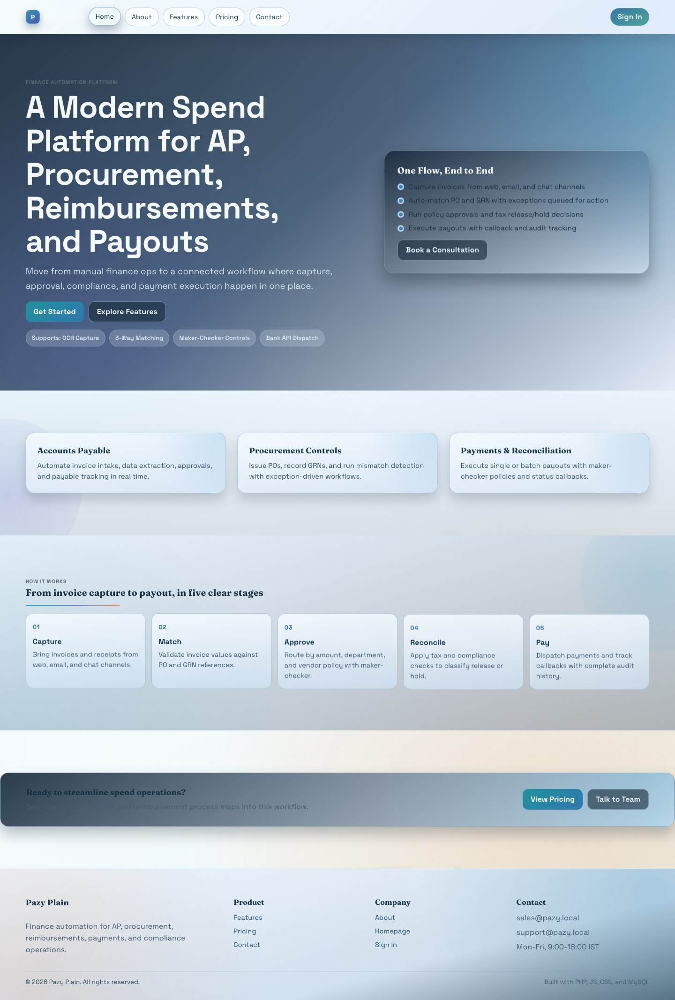
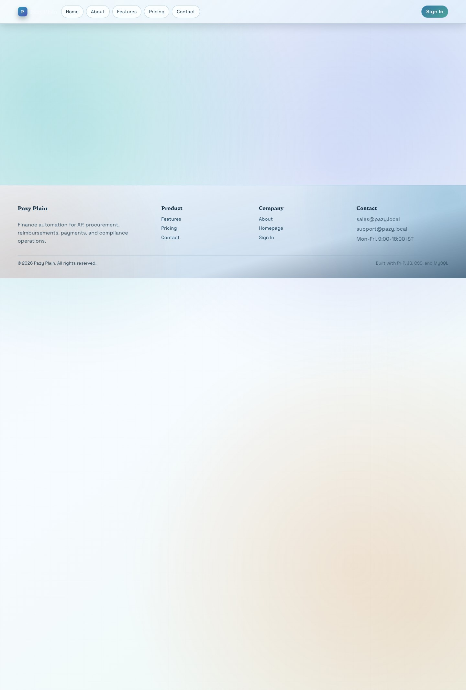
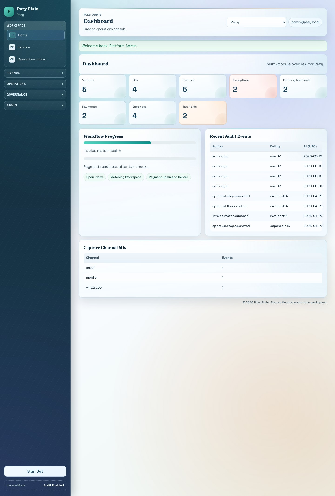
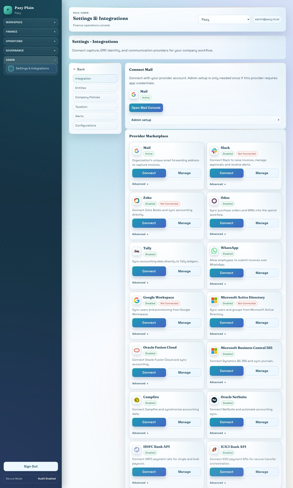
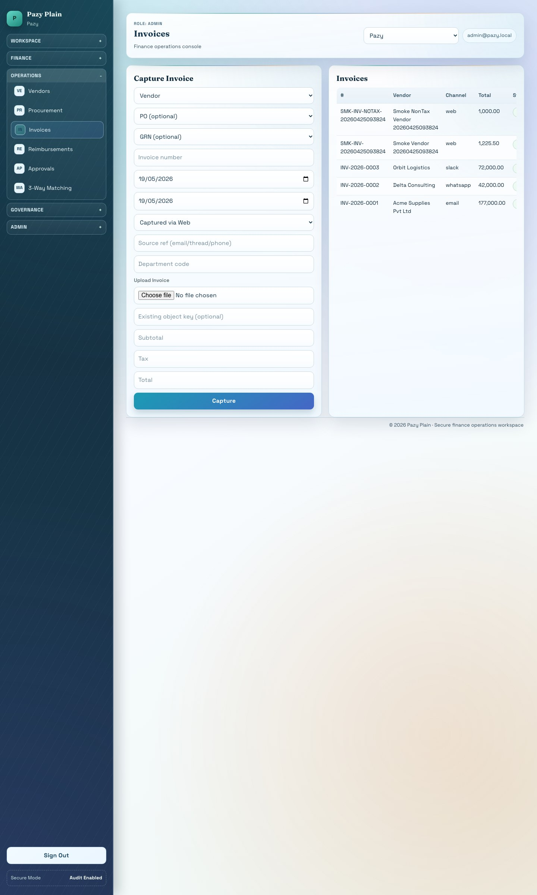
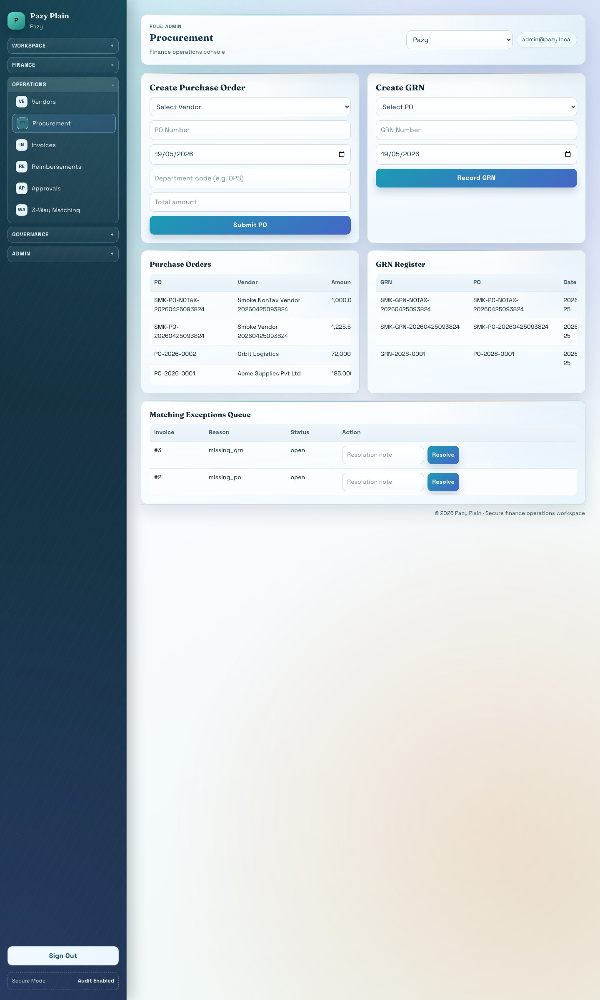
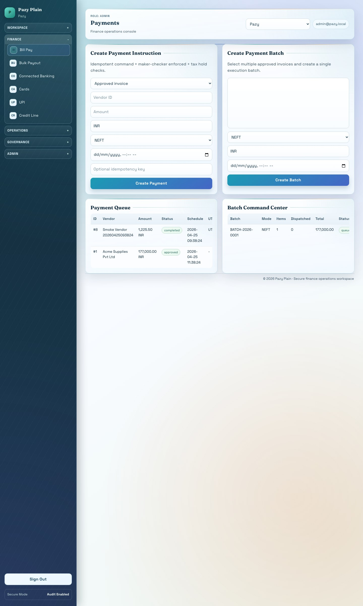
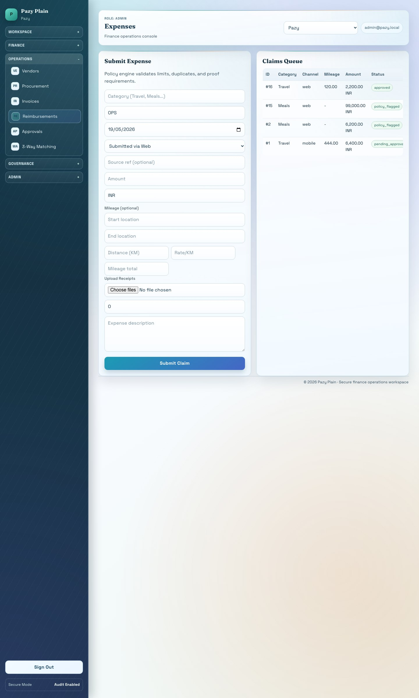
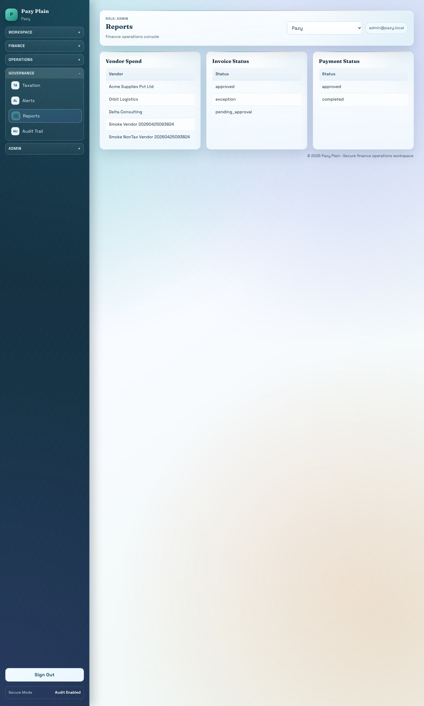

# Pazy Plain - Architecture, Screenshots, Mapping, and Working Guide

This guide explains the complete tool from public website to logged-in finance operations. It includes live screenshots, module splits, file tree, database tree, route map, workflow map, and the remaining setup needed for real external integrations.

## 1. Tool Summary

Pazy Plain is a finance automation web app built for company spend operations. It manages vendors, procurement, invoices, reimbursements, approvals, payments, tax reconciliation, notifications, integrations, reporting, and audit trails.

## 2. Code Stack Used

| Layer | Implementation |
|---|---|
| Frontend | PHP-rendered HTML, CSS, vanilla JavaScript |
| Backend | Core PHP, no Laravel/framework runtime |
| Database | MySQL on XAMPP |
| Server | XAMPP Apache |
| Entry point | `purephp/public/index.php` |
| Web pages | `purephp/src/web.php` |
| API routes | `purephp/src/api.php` under `/api/v1` |
| Layout | `purephp/templates/layout.php` |
| Styling | `purephp/public/assets/css/app.css` |
| Browser JS | `purephp/public/assets/js/app.js` |
| Queue/worker | `purephp/bin/console.php worker:run` and `purephp/scripts/worker_loop.sh` |
| Storage | Local object-style storage in `purephp/storage/object` with SQL metadata |

## 3. Local Links

| Area | URL |
|---|---|
| Public homepage | `http://localhost/pazy/purephp/public/` |
| Login | `http://localhost/pazy/purephp/public/index.php?page=login` |
| Dashboard | `http://localhost/pazy/purephp/public/index.php?page=dashboard` |
| Integrations | `http://localhost/pazy/purephp/public/index.php?page=integrations` |
| API health | `http://localhost/pazy/purephp/public/api/v1/health` |

Default login:

```text
Email: admin@pazy.local
Password: password1234
```

## 4. Live Web App Screenshots

### 4.1 Public Homepage



### 4.2 Login Page



### 4.3 Finance Dashboard



### 4.4 Integrations Marketplace



### 4.5 Invoice and Accounts Payable



### 4.6 Procurement



### 4.7 Payments



### 4.8 Reimbursements



### 4.9 Reports and Audit



## 5. Start-to-End User Journey Tree

```text
Pazy Plain
|-- Public Website
|   |-- Home
|   |-- About
|   |-- Features
|   |-- Pricing
|   |-- Contact
|   `-- Login
|-- Authentication
|   |-- User enters email/password
|   |-- Session is created
|   |-- Role and permissions are loaded
|   `-- Current company scope is selected
|-- Finance Workspace
|   |-- Dashboard
|   |-- Explore More / product hub
|   |-- Operations inbox
|   |-- Work queues
|   `-- Audit status
|-- Master Data
|   |-- Organizations
|   |-- Companies
|   |-- Users
|   |-- Roles
|   |-- Company memberships
|   `-- Vendors
|-- Spend Workflows
|   |-- Procurement
|   |   |-- Purchase order
|   |   |-- PO items
|   |   |-- Goods receipt note
|   |   `-- GRN items
|   |-- Accounts payable
|   |   |-- Invoice capture
|   |   |-- Document upload
|   |   |-- OCR extraction job
|   |   |-- PO-GRN-invoice match
|   |   `-- Exception queue
|   |-- Reimbursements
|   |   |-- Expense claim
|   |   |-- Attachments
|   |   |-- Policy validation
|   |   `-- Approval route
|   |-- Payments
|   |   |-- Single payment
|   |   |-- Bulk payout
|   |   |-- Maker-checker
|   |   |-- Bank dispatch job
|   |   `-- UTR/reference update
|   `-- Tax reconciliation
|       |-- Match invoice with tax provider response
|       |-- Release decision
|       `-- Hold decision
|-- Integrations
|   |-- OAuth connect providers
|   |-- API key providers
|   |-- Webhooks
|   |-- IMAP/email capture
|   |-- Messaging capture
|   `-- Worker retry/dead-letter handling
`-- Final Outputs
    |-- Approved invoices
    |-- Completed payments
    |-- Reimbursed employees
    |-- Tax release/hold report
    |-- Vendor spend report
    |-- Audit timeline
    `-- Integration job history
```

## 6. Module Split Tree

```text
Modules
|-- IAM and RBAC
|   |-- Login/session
|   |-- API bearer tokens
|   |-- Role permissions
|   |-- Company switch
|   `-- Tenant isolation by company_id
|-- Vendors
|   |-- Vendor master
|   |-- Compliance score
|   |-- Contact and bank metadata
|   `-- Identity/MCA validation hook
|-- Procurement
|   |-- Purchase orders
|   |-- PO line items
|   |-- Goods receipts
|   |-- GRN line items
|   `-- ERP sync hook
|-- Accounts Payable
|   |-- Invoice capture
|   |-- Invoice items
|   |-- OCR extraction
|   |-- Three-way matching
|   `-- Matching exception queue
|-- Reimbursements
|   |-- Expense claims
|   |-- Receipt attachments
|   |-- Mileage data
|   |-- Policy violations
|   `-- Payout conversion
|-- Approvals
|   |-- Approval policies
|   |-- Amount thresholds
|   |-- Department/vendor routing
|   |-- Maker-checker guard
|   `-- Approve/reject actions
|-- Payments
|   |-- Payment instructions
|   |-- Connected banking
|   |-- Bulk batches
|   |-- UPI wallet records
|   |-- Corporate cards
|   `-- Credit line records
|-- Tax
|   |-- Reconciliation run
|   |-- Release/hold decision
|   |-- Vendor compliance trend
|   `-- Payment blocking signal
|-- Notifications
|   |-- Email
|   |-- Slack
|   |-- WhatsApp
|   |-- Reminders
|   `-- Notification history
|-- Integrations
|   |-- Provider marketplace
|   |-- OAuth redirect/callback
|   |-- In-app credential vault
|   |-- Webhook ingestion
|   |-- Integration jobs
|   |-- Retry/dead-letter
|   `-- Stub/live provider swap
`-- Reporting and Audit
    |-- Summary reports
    |-- Spend analytics
    |-- Payment status
    |-- Tax status
    |-- Audit events
    `-- Export-ready timelines
```

## 7. Folder and File Tree

```text
purephp/
|-- public/
|   |-- index.php                 # Front controller for website, app, and API
|   |-- .htaccess                 # Apache routing
|   `-- assets/
|       |-- css/app.css            # Full UI styling and responsive layout
|       `-- js/app.js              # Frontend interactions
|-- src/
|   |-- bootstrap.php             # App bootstrap
|   |-- config.php                # Runtime config and env loading
|   |-- Database.php              # PDO MySQL connection
|   |-- Auth.php                  # Login, roles, company scope, API auth
|   |-- Csrf.php                  # CSRF tokens
|   |-- helpers.php               # Shared helpers, URLs, uploads, webhook utilities
|   |-- web.php                   # Server-rendered public and authenticated pages
|   |-- api.php                   # REST API and webhooks
|   `-- App/
|       |-- Enums/StateMachine.php
|       |-- Modules/
|       |   |-- Approvals/ApprovalEngine.php
|       |   |-- Procurement/MatchingEngine.php
|       |   |-- Expenses/ExpensePolicyEngine.php
|       |   |-- Payments/PaymentEngine.php
|       |   |-- Payments/PaymentBatchEngine.php
|       |   |-- Tax/TaxReconciliationEngine.php
|       |   `-- Integrations/
|       |       |-- IntegrationJobWorker.php
|       |       |-- IntegrationOAuth.php
|       |       |-- IntegrationRuntimeConfig.php
|       |       `-- MailInboxPuller.php
|       `-- Integrations/
|           |-- ProviderRegistry.php
|           |-- Contracts/
|           |-- Stub/
|           `-- Live/
|-- templates/
|   `-- layout.php                # Public header/footer and app shell
|-- database/
|   |-- schema.sql                # MySQL table structure
|   `-- seed.sql                  # Demo/local seed data
|-- bin/
|   `-- console.php               # CLI doctor, setup, worker, smoke tests
|-- scripts/
|   |-- setup_local.sh
|   |-- worker_loop.sh
|   |-- run_smoke.sh
|   `-- cron.example
|-- docs/
|   |-- screenshots/              # Live screenshots captured from localhost
|   |-- Pazy_Architecture_Working_Guide.md
|   |-- Pazy_Architecture_Working_Guide.html
|   `-- Pazy_Architecture_Working_Guide.pdf
|-- logs/
|   `-- app-error.log
`-- README.md
```

## 8. Database Tree

```text
pazy_plain MySQL Database
|-- Tenant and identity
|   |-- organizations
|   |-- companies
|   |-- users
|   |-- roles
|   |-- company_user
|   `-- api_tokens
|-- Vendor master
|   `-- vendors
|-- Procurement
|   |-- purchase_orders
|   |-- po_items
|   |-- goods_receipts
|   |-- grn_items
|   `-- matching_exceptions
|-- Invoice capture and AP
|   |-- invoices
|   |-- invoice_items
|   |-- documents
|   `-- capture_events
|-- Reimbursements
|   |-- expense_claims
|   |-- expense_attachments
|   |-- expense_policies
|   `-- expense_policy_violations
|-- Approvals
|   |-- approval_policy_rules
|   `-- approvals
|-- Payments
|   |-- company_accounts
|   |-- payments
|   |-- payment_batches
|   `-- payment_batch_items
|-- Spend products
|   |-- corporate_cards
|   |-- credit_lines
|   `-- upi_wallets
|-- Tax and compliance
|   `-- tax_reconciliations
|-- Integrations
|   |-- company_integrations
|   |-- integration_jobs
|   |-- webhook_events
|   `-- idempotency_keys
|-- Notifications
|   `-- notifications
`-- Security and governance
    |-- audit_events
    `-- request_rate_limits
```

## 9. Current Local Data Snapshot

| Table | Rows |
|---|---:|
| organizations | 1 |
| companies | 2 |
| users | 4 |
| vendors | 6 |
| purchase_orders | 4 |
| goods_receipts | 3 |
| invoices | 5 |
| expense_claims | 4 |
| approvals | 7 |
| payments | 2 |
| company_integrations | 19 |
| integration_jobs | 5 |
| audit_events | 15 |

## 10. Request Routing Tree

```text
HTTP Request
|-- /pazy/purephp/public/
|   `-- public/index.php
|       |-- Load bootstrap/config
|       |-- Start secure session
|       |-- Connect MySQL through Database.php
|       |-- If path starts /api/v1
|       |   `-- route_api_request() in src/api.php
|       |-- Else if POST form action
|       |   `-- handle_web_post() in src/web.php
|       `-- Else render page
|           `-- render_web_page() in src/web.php
```

## 11. API Route Split

```text
/api/v1
|-- GET  /health
|-- POST /auth/login
|-- GET  /organizations
|-- GET  /companies
|-- GET  /users
|-- GET  /vendors
|-- POST /vendors
|-- GET  /purchase-orders
|-- POST /purchase-orders
|-- GET  /grns
|-- POST /grns
|-- GET  /invoices
|-- POST /invoices
|-- POST /documents/upload
|-- GET  /documents
|-- GET  /expenses
|-- POST /expenses
|-- GET  /approvals
|-- POST /approvals/{id}/approve
|-- POST /approvals/{id}/reject
|-- GET  /payments
|-- POST /payments
|-- POST /payments/{id}/execute
|-- GET  /payment-batches
|-- POST /payment-batches
|-- POST /payment-batches/{id}/dispatch
|-- GET  /tax/reconciliations
|-- POST /tax/reconciliations/run
|-- GET  /notifications
|-- GET  /capture-events
|-- GET  /inbox
|-- GET  /reports
|-- POST /workers/integration-jobs/run
`-- POST /webhooks/{provider}/{event}
```

## 12. Invoice Flow Mapping

```text
Invoice arrives
|-- Web upload / email / WhatsApp / Slack / API webhook
|-- Store file in storage/object
|-- Create documents row
|-- Create invoices row with company_id
|-- Queue OCR/extraction integration job
|-- Worker processes OCR job
|-- Extracted data saved in invoice JSON
|-- MatchingEngine checks invoice against PO and GRN
|   |-- If matched
|   |   |-- Status moves to matched
|   |   `-- ApprovalEngine creates approval route
|   `-- If mismatch
|       |-- Status moves to exception
|       `-- matching_exceptions row is created
|-- Approver approves or rejects
|-- If approved, payment can be created
|-- Tax reconciliation can release or hold
|-- PaymentEngine creates payment instruction
|-- Worker dispatches bank provider job
|-- UTR/reference saved
`-- Reports and audit timeline update
```

## 13. Reimbursement Flow Mapping

```text
Employee expense claim
|-- User submits amount, category, date, mileage, description, proof
|-- Attachment metadata stored
|-- ExpensePolicyEngine runs checks
|   |-- Category limit
|   |-- Daily/monthly limit
|   |-- Mileage rule
|   |-- Duplicate check
|   `-- Mandatory proof rule
|-- Clean claim moves to approval
|-- Out-of-policy claim is flagged
|-- Manager/finance approval route is created
|-- Approved claim can become payment instruction
|-- Bulk payout can include approved reimbursements
`-- Audit and reimbursement reports update
```

## 14. Integration Flow Mapping

```text
Integration Marketplace
|-- User sees provider cards with logo/icon
|-- User clicks Connect
|   |-- OAuth provider
|   |   |-- Redirect to provider authorization URL
|   |   |-- User approves on provider platform
|   |   |-- Provider redirects to Pazy callback
|   |   |-- Tokens/account metadata saved in in-app vault
|   |   `-- Status becomes active if callback succeeds
|   `-- API-key/provider setup
|       |-- User opens Manage
|       |-- Admin setup is kept separate from normal user card
|       |-- Required keys saved per company
|       `-- Test connection confirms status
|-- Provider sends webhook
|   |-- Signature is verified
|   |-- Idempotency key prevents duplicate processing
|   |-- Payload is stored as webhook event
|   `-- Integration job is queued
`-- Worker processes job with retry/dead-letter behavior
```

## 15. Approval and Maker-Checker Mapping

```text
Entity needs approval
|-- ApprovalEngine reads policy rules
|-- Rules inspect amount, vendor, department, entity type, and company scope
|-- Approval rows are created by level
|-- Maker-checker guard checks initiator != checker for restricted actions
|-- Approver approves or rejects
|-- Entity status updates only through allowed state transitions
`-- Audit event is written for every critical action
```

## 16. State Mapping

| Domain | Main States |
|---|---|
| Invoice | captured, processed, matched, exception, approved, paid, rejected |
| PO | draft, approved, closed |
| Expense | submitted, flagged, approved, rejected, paid |
| Approval | pending, approved, rejected |
| Payment | pending_approval, approved, processing, completed, failed, blocked |
| Tax | release, hold, review |
| Integration job | pending, running, completed, retrying, dead_letter |

## 17. Screen-to-Module Map

| Screen | Module | Main Tables | Main Code |
|---|---|---|---|
| Public website | Marketing/public pages | contact/audit if submitted | `src/web.php`, `templates/layout.php` |
| Login | IAM/RBAC | `users`, `roles`, `company_user` | `Auth.php`, `src/web.php` |
| Dashboard | Operations overview | invoices, payments, approvals, tax | `src/web.php` |
| Vendors | Vendor management | `vendors` | `src/web.php`, `src/api.php` |
| Procurement | PO/GRN | `purchase_orders`, `goods_receipts` | `MatchingEngine.php` |
| Invoices | AP automation | `invoices`, `invoice_items`, `documents` | `src/web.php`, `MatchingEngine.php` |
| Matching | Exception handling | `matching_exceptions` | `MatchingEngine.php` |
| Expenses | Reimbursements | `expense_claims`, `expense_policy_violations` | `ExpensePolicyEngine.php` |
| Approvals | Governance | `approvals`, `approval_policy_rules` | `ApprovalEngine.php` |
| Payments | Payouts | `payments`, `payment_batches` | `PaymentEngine.php`, `PaymentBatchEngine.php` |
| Tax | Reconciliation | `tax_reconciliations` | `TaxReconciliationEngine.php` |
| Integrations | Provider marketplace | `company_integrations`, `integration_jobs`, `webhook_events` | `IntegrationOAuth.php`, `ProviderRegistry.php` |
| Reports | Analytics/audit | all transactional tables, `audit_events` | `src/web.php`, `src/api.php` |

## 18. External Connection Responsibility

Already implemented in code:

```text
|-- In-app provider marketplace
|-- Connect/Manage UI
|-- OAuth redirect/callback structure
|-- Per-company integration storage
|-- Stub providers for local workflows
|-- Live adapter placeholders for bank, ERP, tax, messaging, identity
|-- Webhook endpoint with signature/idempotency checks
|-- Worker queue with retry/dead-letter behavior
```

Still required from the real provider/account owner:

```text
|-- Create developer apps in Slack, Zoho, Google, Microsoft, WhatsApp, bank, tax, ERP portals
|-- Add Pazy callback URL to each provider app
|-- Get client ID, client secret, webhook signing secret, API base URL, and account IDs
|-- Enter those values in the app Manage panel
|-- Approve OAuth on the provider platform
|-- Enable webhook delivery from the provider dashboard
|-- Run Test Connection and worker validation
```

## 19. Commands for Setup and Verification

```bash
cd /Applications/XAMPP/xamppfiles/htdocs/pazy/purephp
./scripts/setup_local.sh
php bin/console.php infra:doctor
php bin/console.php integrations:preflight --probe=1
php bin/console.php qa:smoke --company=1
php bin/console.php worker:run --limit=50
```

Expected smoke result:

```text
Smoke QA passed
- Invoice flow creates invoice and payment
- Reimbursement flow flags and approves claims
- Tax flow creates release/hold decision
```

## 20. Final Output Map

```text
Input
|-- Invoice file
|-- PO/GRN data
|-- Expense receipt
|-- Vendor details
|-- Payment instruction
|-- Provider webhook
`-- Tax/integration response

Processing
|-- Validation
|-- Company isolation
|-- Policy rules
|-- Matching rules
|-- Approval routing
|-- Provider dispatch
|-- Retry/dead-letter
`-- Audit logging

Output
|-- Approved invoice
|-- Matching exception
|-- Approved reimbursement
|-- Completed payment with UTR/reference
|-- Tax release/hold decision
|-- Notification
|-- Report
`-- Audit timeline
```

## 21. What This Tool Does in One Line

Pazy Plain is a pure PHP and MySQL finance automation platform that centralizes vendor data, procurement, invoices, reimbursements, approvals, payments, integrations, tax decisions, reporting, and audit history in one company-scoped workspace.
